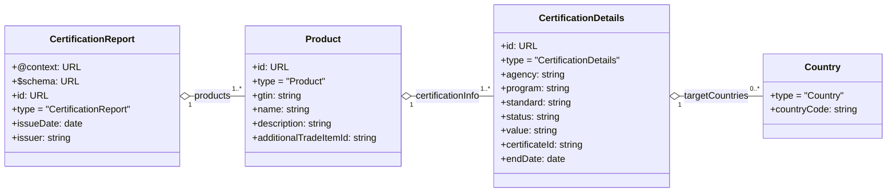

# certification-data-model

This repository contains a data model to share certification summary information between trading partners.

# Contents

The ```docs``` folder contains the JSON schema for the compacted (JSON) format document as well as the JSON-LD context for
expanding into globally defined terms.

The ```examples``` folder contains a compact form sample certification report, and the expanded (and then compacted)
version. You can get the equivalent to this by entering the ```jsonCertSample.json``` file into [https://json-ld.org/playground/]
and selecting the compact version.

The script ```validate.py``` validates the sample file against the schema and the expands and compacts it an ensures
its matching (no data lost).


# Data Element Details

A table describing the data elements can be found [here](https://gs1us-technology.github.io/certification-data-model/data_details.html)

# Data Hierarchy


